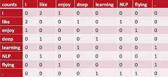

# N-gram의 한계와 차원의 저주

- n-gram은 치명적인 문제가 있다
  - 슬라이딩 윈도우 방식이든, 순차적 방식이든, 백 오프 방식이든 어떤 방식을 쓰더라도 나오지 않은 문장은 생성해 낼 수 없다
  - 물체의 유사도를 얻어내어 비슷한 단어들이 오게 만드는 것은 불가능하다
- 학습을 시키는 것은 의외로 간단하고, 데이터 셋을 얻어내는 것이 굉장히 어렵다
  - 데이터 셋에서 가능한 모든 단어의 연결을 가진 문장을 찾기도 불가능할 뿐더러 메모리 사용량도 엄청나다
  - tri-gram으로 구현한다고 하더라도 데이터 셋이 10000개라면 10000^3에 가까운 데이터가 메모리에 올라갸아해서 사실상 불가능하다

- co occurrence matrix
  - 몇 단어가 되지않는 단어의 모음도 연관이 있더라도 데이터상 연결이 안되는 단어가 많다
  - 더 많은 크기의 데이터 셋에서는 가능한 단어의 연결이 없는 경우도 굉장히 많고, 설령 있다고 하더라도 메모리가 부족한 문제가 생겨 명확한 한계가 생긴다
  - 이것이 '차원의 저주'이다