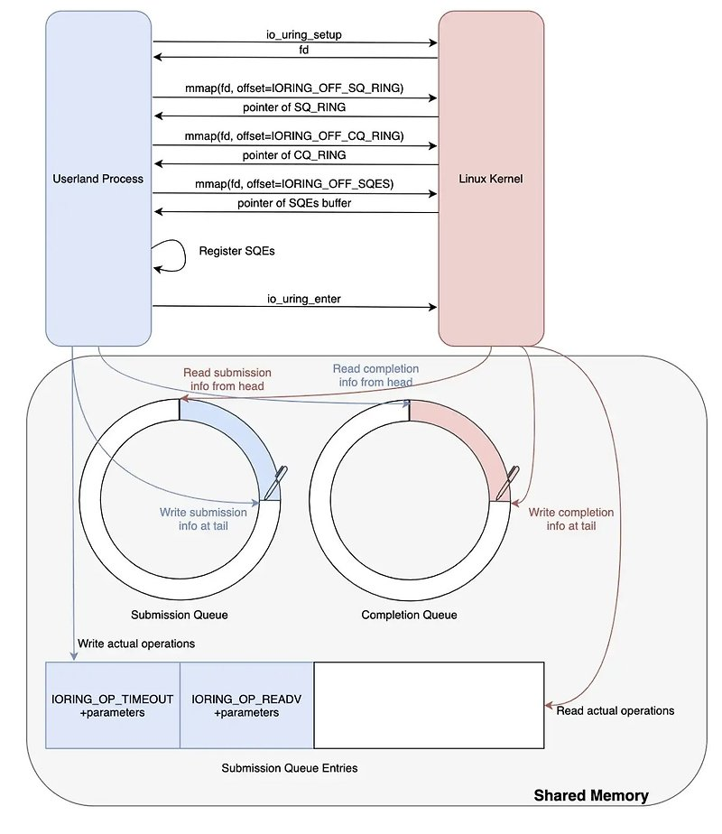

# io_uring

- io_uring은 linux kernel 5.1부터 도입된 고성능 I/O system call이다
- epoll은 reactor I/O 모델이며, IOCP/io_uring은 proactor I/O 모델이다
  - reactor I/O 모델은 fd의 상태에 관심을 가지기 때문에 fd의 변화 감지 -> 상태 변화 통지 -> 내 메모리로 복사 요청 -> 복사 완료 -> 사용의 구조를 가진다
  - proactor I/O 모델은 결과물에만 관심을 가져 event 요청 -> 작업 완료 후 결과를 메모리로 복사 후 통지 구조를 가진다
- 기존 epoll보다 높은 성능을 내기 위해 만들어졌다
  - 기존 epoll의 경우는 2번의 system call이 발생한다(epoll.wait(), recv() or read())
  - system call을 한번으로 줄인 iocp에 대응하는 linux의 system call이다
- 동작
  - kernel이 생성한 두 개의 링 버퍼(submisson queue 제출 큐, completion queue 완료 큐)를 유저 공간과 mmap으로 공유하여, system call 없이도 lockless하게 요청과 완료를 주고받는다
    - IOCP와 동일하게 async req를 할때 완료 위치(addr)를 파라미터로 넘겨 client가 관리한다
    - io_uring 초기 설정에 따라 completion queue에 추가시 통지를 받을 수도 있으며, user process에서 요청을 통해 완료 된 정보의 위치 배열(addr[])을 받아갈 수도 있다(SQPOLL, IOPOLL설정을 통해 커널 큐가 상시 감시하게 만들 수 있다/ system call 횟수 최소화)