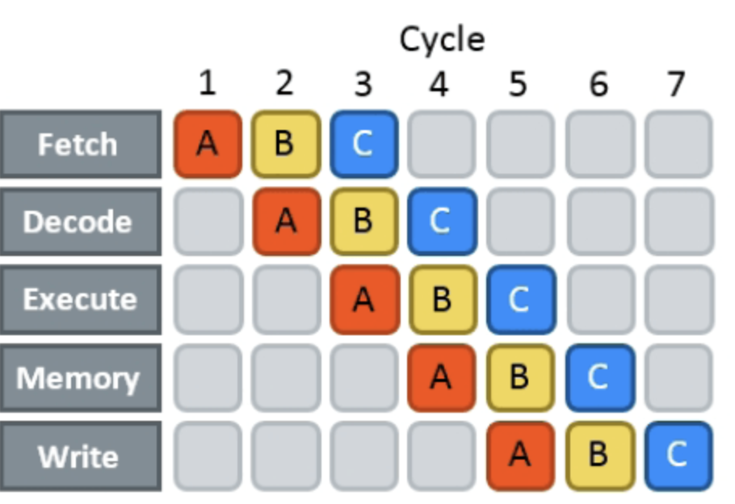

# Chapter 4. 트랜지스터에서 CPU로, 이보다 더 중요한 것은 없다

## Section 4.2. CPU는 유휴상태일 때 무엇을 할까?

- CPU가 유지되기 위해서는 어떤 프로세스든 실행이 되고 있어야 한다
  - Window에서는 가장 낮은 우선순위로 `System Idle Process`가 존재한다
    - 더 이상 스케줄링 할 프로세스가 없을 때 `halt`명령이 실행된다
    - 이는 process를 일시중지 시키는 `suspend`와는 다르다
    - `System Idle Process`는 `halt`명령어를 실행하는 순환이며, `halt`명령어를 실행해 저전력 상태로 진입한다
  ```C
  // Linux kernel의 구현 예시
  while (1)
  {
    // 재스케쥴링이 필요 없다면(할 일이 없다면)
    while (!need_resched()) 
    {
        // halt명령을 실행시킨다
        cpuidle_idle_call();
    }
  }
  ```  
  - 위 코드가 컴퓨터 시스템이 유휴 상태일때 CPU가 하는 일이며 핵심은 `halt`명령을 실행시키는 것이다
  - 가장 많이 실행되는 명령어는 대부분 `halt`이다
- 그렇다면 무한 순환 중인 `halt`상태의 탈출은 어떻게 해야할까?
  - 운영체제는 일정 시간마다 timer interrupt를 생성하고, CPU는 interrupt신호를 감지해 interrupt처리 프로그램을 실행한다
  - 즉, `System Idle Process`가 실행 중일때 timer interrupt를 통해 일시 중지시키고 interrupt 처리 함수는 시스템에 준비 완료된 프로세스가 있는지 확인하고 없다면 `System Idle Process`를 게속 실행한다
  - 즉, OS의 유휴 상태는 CPU가 무한 루프를 돌며 전력을 낭비하는 Spin 대기 방식을 사용하지 않고, halt 명령어로 CPU를 잠재운 뒤 주기적인 timer Interrupt 신호를 통해 깨어나는 방식으로 저전력을 유지하는 것이다
    - CPU가 깨어날 때를 제외하고는 완전히 멈춰(halt) 있으며, 특정 주기마다 외부 타이머 하드웨어가 던져주는 인터럽트 신호를 수동적으로 받아서 깨어나 할 일을 확인하는 구조다

## Section 4.4. CPU가 if문을 만났을 때

```Cpp
const unsigned arraySize = 10000;
int data[arraySize];

long long sum = 0;
// 크가가 10000인 정수 배열을 만드록 배열에서 128보다 큰 모든 요소의 합을 계산하는 작업을 100,000번 반복한다
for (unsigned i = 0; i < 100000; ++i) 
{
    for (unsigned c = 0; c < arraySize; ++c)
    {
        if(data[c] >= 128) 
        {
            sum += data[c];
        }
    }
}
```
- 위 코드는 특별한게 없다
  - 하지만 배열의 상태에 따라 재미있는 점이 있는데, 배열 요소가 이미 정렬된 상태라면 2.8초 내에 실행되지만, 배열 요소가 임의로 배치되어 있다면 실행 시간이 7.5초가 걸린다(컴퓨터 사양에 따라 달라진다)
- linux의 `perf`를 사용해 프로그램 실행 상태에 대한 초기 단계를 분석하면 아래와 같다
```plaintext
.. 정렬된 배열을 사용해 실행된 프로그램의 통계자료
branch-misses # 0.02% of all branches (62.55%)
.. 정렬되지 않은 배열을 사용해 실행된 프로그램의 통계자료
branch-misses # 14.12% of all branches (62.49%)
```

### 위 예시의 속도의 차이가 심한 이유



- CPU는 초당 수십억 개의 명령을 처리할 수 있는 능력을 가지고 있으며, 효율적으로 처리하기 위해 pipeline기술을 사용한다
  - CPU의 기계 명령어 처리는 명령어 인출(instruction fetch), 명령어 해독(intruction decode), 실행(execute), 다시 쓰기(write back)으로 진행된다
    - CPU는 효율을 극대화하기 위해 현재 명령어가 실행되는 동안, 다음에 실행될 예정인 명령어들을(여러 세트) 미리 가져와 prefetch한다
    - 이때 if문 같은 분기 명령어를 만나면, CPU 내부의 분기 예측기(Branch Predictor)가 과거 데이터 등을 바탕으로 True or False 쪽 코드가 실행될지 확률적으로 예측하고, 그 예측된 경로의 명령어를 pipeline에 미리 올린다
    - 정렬된 배열에서는 `128보다 작다` 혹은 `크다`라는 패턴이 일정하게 유지되므로 CPU의 예측 성공률이 매우 높다
    - 반면 정렬되지 않은 배열에서는 규칙성이 없어 예측이 자주 틀리게 된다. 예측이 틀리면 pipeline에 미리 쌓아두고 처리 중이던 명령어들을 모두 폐기하고 새로 코드를 읽어와야 하는데, 이를 branch-misses라고 하며 심각한 성능 저하가 발생한다